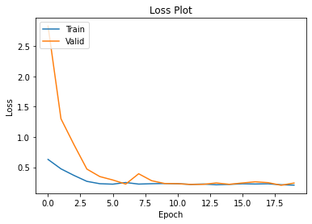

# StatColorNet


The project prediction of **state** and **color** of an input image.

## Getting Started
The required packages can be installed through: 
```sh
pip install -r requirements.txt
```

## Downloading Dataset 
The dataset can be downloaded from [Google Drive](https://drive.google.com/file/d/10J97YhL_0YB298fqekLm0t9rU9jRWEoD/view?usp=sharing). Alternatively, it can also be downloaded using `gdown`. 

```sh
# update gdown
pip install --upgrade --no-cache-dir gdown

# download zip dataset file 
gdown "https://drive.google.com/u/0/uc?id=10J97YhL_0YB298fqekLm0t9rU9jRWEoD" -O dataset.zip

# upzip dataset
unzip dataset.zip
```

## Data Exploration and Processing
The data exploration and processing script can be found as a notebook at: 
```
src/
└── EDA.ipynb
```

The following script explores the downloaded dataset by plotting samples and their respective labels randomly. 

The script also processes the dataset into a single CSV file to be easily loaded in the model through DataLoader module. 

The processed CSV file can be found at `assets/labels.csv`.

## Experiments 
All experiments have been included as a notebook that can be found at: 
```
src/
└── Experiments.ipynb
```

Following type of models have been experimented with: 

### Base Model 
<p align="center">
  
</p>

### TransferNet
<p align="center">
  
</p>

### DeepTransferNet
<p align="center">
  
</p>

Trained weights of the experimented models can be accessed [here](https://drive.google.com/drive/folders/1CxLhvCcz7fjmsntrIUAlcKG4fEsuf71M?usp=sharing).